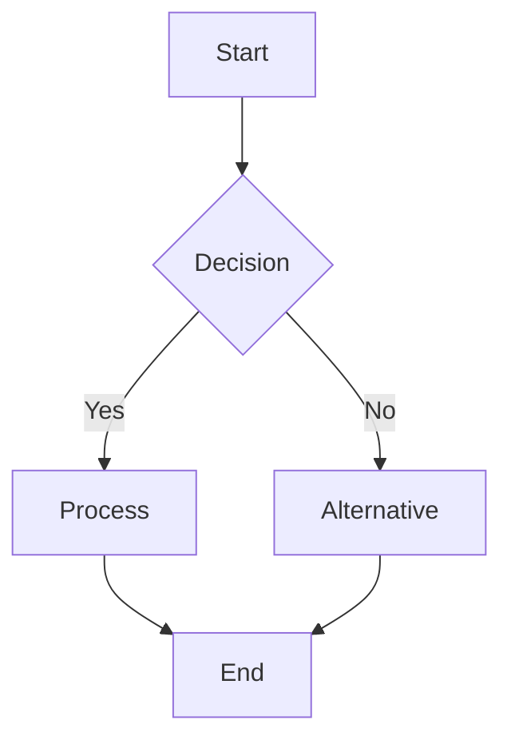
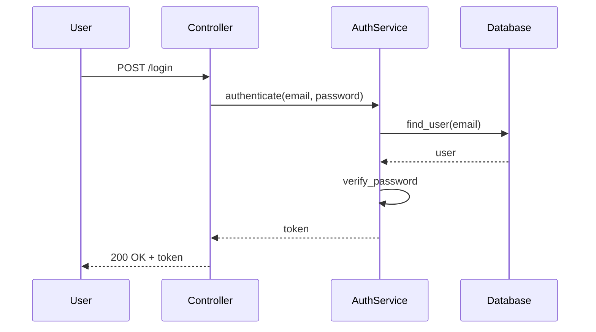
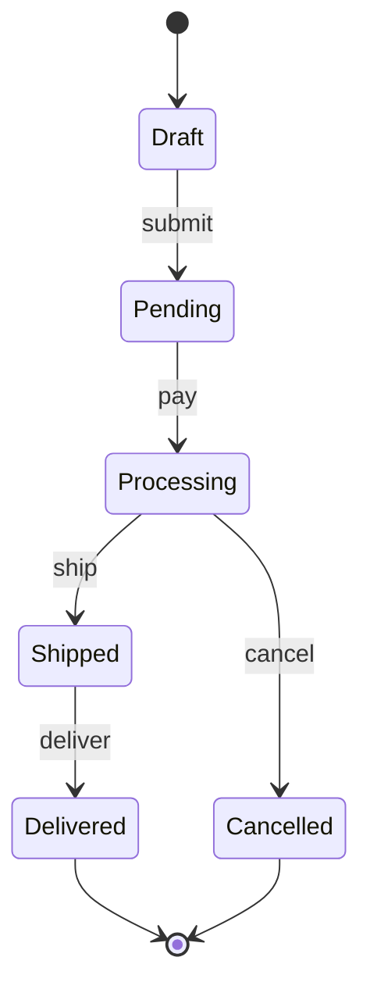
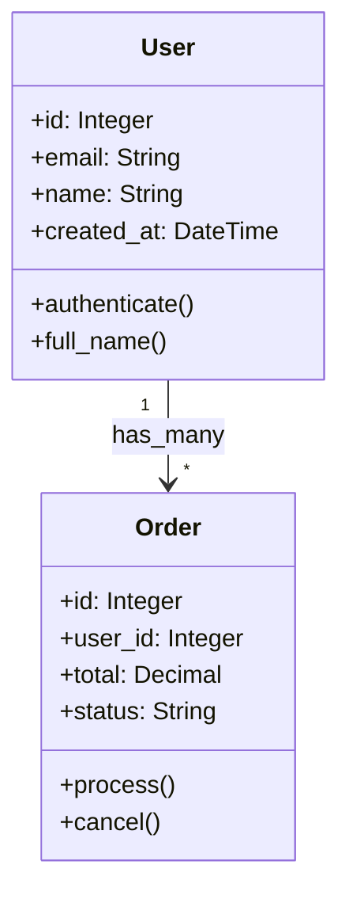

# Mermaid Diagram Generator

This command analyzes code and generates Mermaid diagrams for visualization and documentation.

## Usage

```
/pls_diagram HEAD flow                           # Flow chart of last commit
/pls_diagram app/models/*.rb class              # Class diagram for models
/pls_diagram app/controllers/auth.rb sequence   # Sequence diagram for auth flow
/pls_diagram db/schema.rb erd                    # Entity relationship diagram
/pls_diagram app/services/payment.rb state      # State machine diagram
```

## What it does

1. Analyzes the specified code or commits
2. Identifies relationships and flows
3. Generates appropriate Mermaid diagram syntax
4. Saves to temp file for easy copying
5. Includes rendering instructions

## Diagram Types

### Flow Chart
Shows control flow and decision paths
```
/pls_diagram app/services/checkout.rb flow
```
- Method calls and execution paths
- Conditional branches
- Loop structures
- Error handling flows
- Return paths

### Class Diagram
Shows class relationships and structure
```
/pls_diagram app/models/*.rb class
```
- Class inheritance
- Module mixins
- Associations (has_many, belongs_to)
- Methods and attributes
- Interfaces and abstractions

### Sequence Diagram
Shows interaction between components
```
/pls_diagram app/controllers/api/*.rb sequence
```
- Request/response flows
- Method call sequences
- Actor interactions
- Async operations
- Error scenarios

### Entity Relationship Diagram
Shows database structure
```
/pls_diagram db/schema.rb erd
```
- Table relationships
- Foreign keys
- Indexes
- Data types
- Cardinality

### State Machine Diagram
Shows state transitions
```
/pls_diagram app/models/order.rb state
```
- States and transitions
- Events and triggers
- Guards and conditions
- Actions and callbacks
- Terminal states

### Architecture Diagram
Shows system components
```
/pls_diagram app/ architecture
```
- Service boundaries
- Data flow
- External dependencies
- API integrations
- Queue/job systems

## Output Format

Generated diagrams will include:

### Diagram Code


### Metadata
- Title and description
- Key/legend if needed
- Color coding explanations
- Complexity warnings

### Rendering Instructions
- How to view in GitHub/GitLab
- VSCode extension recommendations
- Online editor links
- Export options

## Smart Detection

The command will auto-detect appropriate diagrams:

### For Controllers
- Sequence diagrams for request handling
- Flow charts for complex logic

### For Models
- Class diagrams for relationships
- State diagrams for status fields
- ERD for database structure

### For Services
- Flow charts for business logic
- Sequence diagrams for external calls

### For Background Jobs
- Flow charts with retry logic
- State diagrams for job status

## Advanced Features

### Customization Options
```
/pls_diagram file.rb flow detailed        # Include all branches
/pls_diagram file.rb class minimal        # Only public interface
/pls_diagram file.rb sequence errors      # Focus on error paths
```

### Multiple File Analysis
```
/pls_diagram "app/models/*.rb app/services/*.rb" class
```
- Combines multiple files
- Shows inter-file relationships
- Groups by namespace

### Commit-Based Diagrams
```
/pls_diagram HEAD flow                    # Changes in last commit
/pls_diagram HEAD~5..HEAD class          # Changes over 5 commits
```

## Examples

### Authentication Flow


### Order State Machine


### Model Relationships


## Requirements

- Analyzes Ruby/Rails code structure
- Understands ActiveRecord associations
- Detects state machines and workflows
- Identifies service interactions
- Maps database relationships

## Notes

- Diagrams are optimized for clarity over completeness
- Complex flows may be simplified for readability
- Includes comments explaining non-obvious relationships
- Follows Mermaid best practices for rendering
- Output can be pasted directly into markdown files

ARGUMENTS: $ARGUMENTS