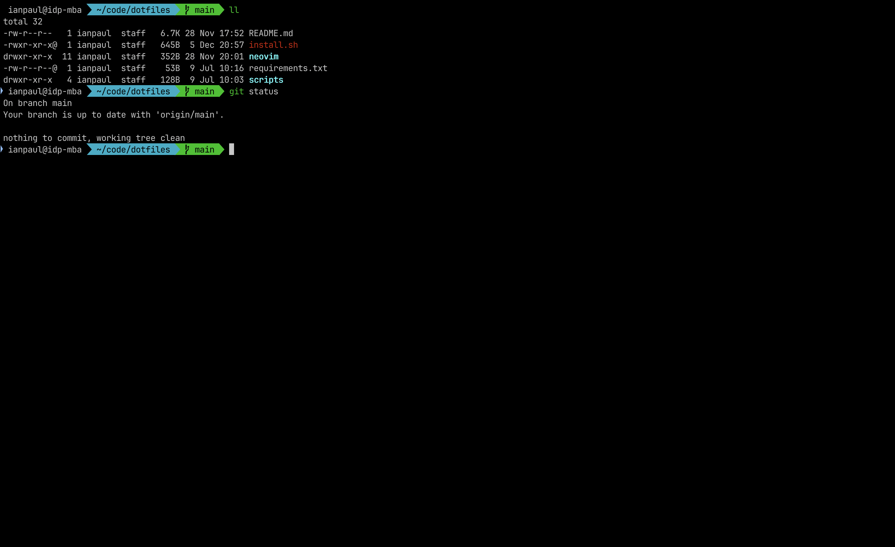
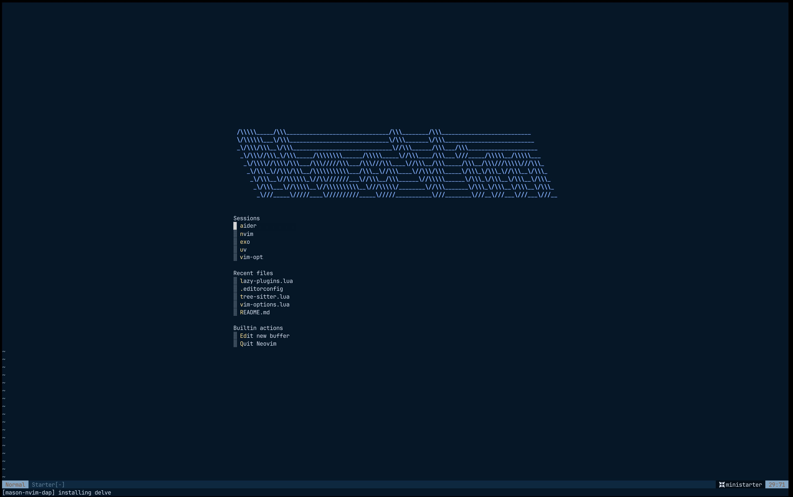
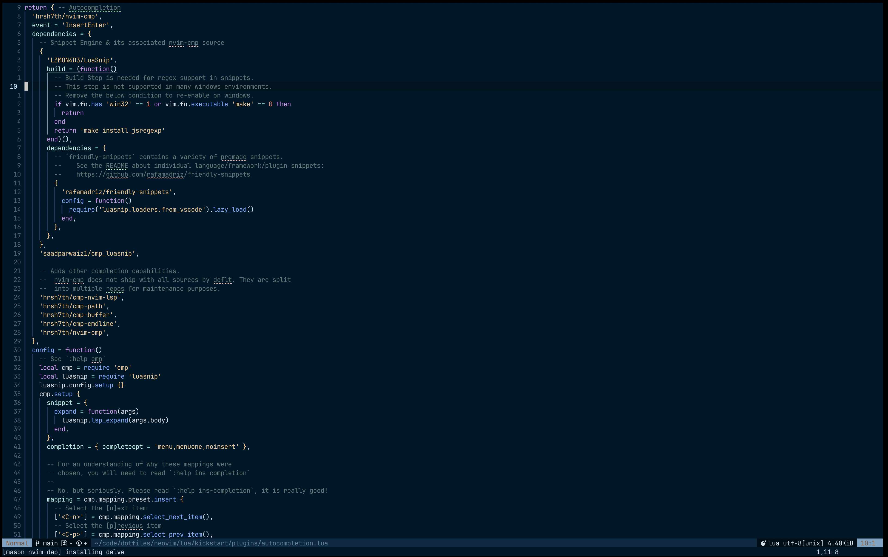

# dotfiles

Collection of config files and scripts for my personal Mac setup.

To setup this config for a new mac, simply clone this repo, follow the below steps, and then run `bash install.sh` from the root of this repo.

If you just want the zsh and nvim setup, simply clone this repo and run `bash install.sh`

## What does it look like?

## Neovim files

- `neovim/init.lua` is the main Neovim config file
- all files in the `/neovim` folder can be copied into the `~/.config/nvim` folder to setup your Neovim config

## New Mac Setup Instructions

Instructions for setting up your new Mac (as of Feb 2024).

Inspired by and heavily referencing (Both courtesy of this tweet https://twitter.com/karpathy/status/1762648404029759758):

- https://www.swyx.io/new-mac-setup
- https://sourabhbajaj.com/mac-setup

### Install Homebrew

1. Run `/bin/bash -c "$(curl -fsSL https://raw.githubusercontent.com/Homebrew/install/master/install.sh)"`
2. Run `echo 'eval "$(/opt/homebrew/bin/brew shellenv)"' >> ~/.zprofile`
   1. To make the Homebrew-installed programs available in your shell, you need to add your Homebrew installation location to your $PATH

### Browser

I'm using zen as my default browser for now.

1. Download Chrome https://www.google.com/chrome/
   1. Update your `chrome://flags/` to have [all websites dark-mode](https://www.howtogeek.com/446198/how-to-force-dark-mode-on-every-website-in-google-chrome/)
2. Install [FireFox](https://www.mozilla.org/en-US/firefox/new/)
3. Install [zen](https://github.com/zen-browser/desktop)
4. Privacy focused:
   1. Download [Brave](https://brave.com/)
   2. Install [LibreWolf](https://librewolf.net/), a security-focused fork of Firefox
      1. Run `brew install --cask librewolf --no-quarantine`

### Terminal setup

#### WezTerm

1. Install wezterm `brew install --cask wezterm`
2. Follow the below instructions to setup the shell

#### iTerm2

No longer main terminal, WezTerm is much easier to customize with lua

1. Download iTerm2 `brew install --cask iterm2`
   1. Update the blue colour in `iTerm -> Settings -> Profiles -> [ choose needed profile ] -> Colors` for a better exp with agnoster's theme
2. Download nerd fonts and set iTerm2's font to it
   1. `brew tap homebrew/cask-fonts && brew install --cask font-source-code-pro && brew install --cask font-jetbrains-mono`
   2. iTerm2 settings -> Profile -> Text -> Font -> set to source code pro
3. Shortcuts -- get better default shortcuts by setting the preset keys to `Natural Text Editing` (e.g. `CMD + Backspace` & `Option + Backspace`)
   1. iTerm2 Settings -> Profile -> Keys -> Presets -> Natural Text Editing

#### Zsh setup

1. Install oh-my-zsh `sh -c "$(curl -fsSL https://raw.github.com/ohmyzsh/ohmyzsh/master/tools/install.sh)"`
2. If you want jetbrains mono nerd-font, install with `curl -OL https://github.com/ryanoasis/nerd-fonts/releases/latest/download/JetBrainsMono.tar.xz`
3. Set `~/.zprofile` and `~/.zshrc` to the files in this folder (running install shell script should do this for you)
4. Install github CLI `brew install gh`
   1. Run `gh auth login`
   2. add GitHub SSH key (NOT optional)
5. Add `[dotenv](https://github.com/ohmyzsh/ohmyzsh/tree/master/plugins/dotenv)` into your list of zsh plugins in `.zshrc`
   1. This helps with loading `.env` env vars automatically when you `cd` into a given folder
6. Install [fzf](https://github.com/junegunn/fzf) `brew install fzf`
7. Install [ripgrep](https://github.com/BurntSushi/ripgrep) `brew install ripgrep`
8. Install [fzf-tab](https://github.com/Aloxaf/fzf-tab) `git clone https://github.com/Aloxaf/fzf-tab ${ZSH_CUSTOM:-~/.oh-my-zsh/custom}/plugins/fzf-tab`
9. Install [fzf-autosuggestions](https://github.com/zsh-users/zsh-autosuggestions) `brew install zsh-autosuggestions`
10. Install [fzf-syntax-highlighting](https://github.com/zsh-users/zsh-syntax-highlighting) `brew install zsh-syntax-highlighting`

### Text editor setup

#### Neovim

1. Based on [kickstart.nvim](https://github.com/nvim-lua/kickstart.nvim) and [this guide](https://www.youtube.com/watch?v=m8C0Cq9Uv9o)
2. Follow the installation instructions in the [kickstart.nvim](https://github.com/nvim-lua/kickstart.nvim#installation) repo
   1. Install these pre-requisites: `brew install neovim ripgrep xclip luajit luarocks`
   2. Run: `git clone https://github.com/ianpaul10/kickstart.nvim.git "${XDG_CONFIG_HOME:-$HOME/.config}"/nvim`
3. You're off to the races! Run `nvim .` to open a new file/folder in neovim

#### VSCode

1. Install vscode
   1. Run `brew install --cask visual-studio-code`
2. To ensure debugging works on vscode:
   1. System Preferences -> Desktop & Dock -> Keyboard & Mouse Shortcuts -> Show Desktop -> Keyboard Shortcut -> toggle off F11 key. (`F11` should be reserved for step through debugging)
3. Run `code .` to open a new file/folder in vscode

#### Nano

Should already come pre-installed. Simply run `nano` in the terminal to open a new file.

### Python setup

1. Install pyenv `brew install pyenv`
2. Run `pyenv install 3` to get the latest python 3
3. Run `pip install virtualenv` to install virtualenv locally
4. Run `git clone https://github.com/pyenv/pyenv-virtualenv.git $(pyenv root)/plugins/pyenv-virtualenv` and `pyenv global 3` to activate what you just installed.
5. When starting/loading a new python repo:
   1. Start a new python virtual environment `python3 -m venv venv` (or replace the 2nd venv with whatever you want to name your virtual env, e.g. `.venv`)
   2. Activate the python virtual environment `source venv/bin/activate`
   3. When done work in that repo, run `deactivate`
   4. This will help keep dependencies for a given repo local to that `/venv` folder inside the root repo dir
   5. Be sure to include `venv` in your `.gitignore` file to not have the packages brought into source control

### Ruby setup

1. Install ruby env/version manager: `brew install rbenv`
   1. Skip for work machines (don't think it's compatible)
   2. Note it's not sourced in the .zshrc anymore because of ^
2. Install relevant ruby versions: `rbenv install 3.4.1` (or any other version, see which are available via `rbenv install -l`)
3. Set global ruby version: `rbenv global 3.4.1`. rbenv will choose the specific version based on the dir you're in based on the `.ruby-version` file, and otherwise will default to the global version
4. Install formatter `brew install rubyfmt` (optional)

### Node.js setup

1. Install node version manager
2. `brew install nvm`
3. Ensure you update your `.zshrc` with the appropriate info to load node properly.
4. Install node.js
5. `nvm install node # install most recent Node stable version`
6. Node.js and nvm config included in `.zshrc`

### .NET/C# setup

1. `brew install dotnet`

### Local scripts setup

1. `jarvis` command to ask GPT-4 a question from the command line
   1. Run `pip install -r requirements.txt` to install the required packages
   2. Run `cp .env.example .env` to create a `.env` file
   3. Update the `.env` file with your OpenAI API key & Groq (**not Grok**) API key
2. If you want to add any new scripts, add them in the `/scripts` folder and include an `alias` in your `.zshrc` file to run them. Be sure to update the local scripts setup alias in `.zshrc` to point to the new script.
3. Heavily inspired from [dnbt777](https://github.com/dnbt777/EasyModularScripts/tree/main)

### Misc

1. Finder settings change
   1. Settings > advanced > show filename extensions
   2. Enable showing dotfiles (`Cmd + Shift + . (dot)` in a Finder window)
   3. Show path bar in footer for easier navigation (View -> Show Path Bar)
2. System preferences
   1. Desktop & Dock
      1. Dock size nearly smallest & magnification to max
   2. Displays -> Night shift
      1. Enable Sunset to Sunrise
      2. Set color temperature to more warm
3. Install FlyCut from the app store (copy/paste clipboard)
   1. `brew install --cask flycut`
   2. Preferences -> Move pasted items to top of stack -> Select check box
4. Install docker
   1. Run `brew install --cask docker`
5. Install spotify
   1. Run `brew install --cask spotify`
6. Install logitech mouse settings app
   1. Run `brew install --cask logitech-options`
7. Install [protonVPN](https://protonvpn.com/download/macos)
   1. Run `brew install --cask protonvpn`
8. [Desktop background](https://apod.nasa.gov/apod/ap210129.html)
9. Private env vars that you want access to in your terminal can be put into `.zshenv`
10. If you see a blue arrow at the beginning of your terminal prompt, it's likely a iTerm2 issue. See [here](https://github.com/ohmyzsh/ohmyzsh/issues/5088#issuecomment-221139633) to fix it.
11. Install rectangle for window/tile management `brew install rectangle`
